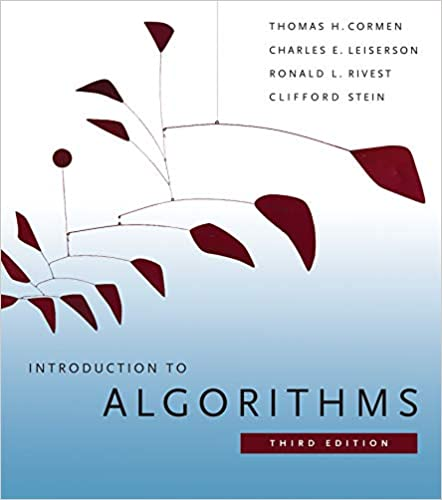

# Introduction to Algorithms

#### Progress...

Chapter | Title | Done
------- | ----- | ----
01 | The Role of Algorithms in Computing | :heavy_check_mark:
02 | Getting Started | 
03 | Growth of Functions | 
04 | Divide and Conquer | 
05 | Probabilistic Analysis and Randomized Algorithms | 
06 | Heapsort | 
07 | Quicksort | 
08 | Sorting in Linear Time | 
09 | Medians and Order Statistics | 
10 | Elementary Data Structures | 
11 | Hash Tables | 
12 | Binary Search Trees | 
13 | Red-Black Trees | 
14 | Augmenting Data Structures | 
15 | Dynamic Programming | 
16 | Greedy Algorithms | 
17 | Amortized Analysis | 
18 | B-Trees | 
19 | Fibonacci Heaps | 
20 | van Emde Boas Trees | 
21 | Data Structures for Disjoint Sets | 
22 | Elementary Graph Algorithms | 
23 | Minimum Spanning Trees | 
24 | Single-Source Shortest Paths | 
25 | All-Pairs Shortest Paths | 
26 | Maximum Flow | 
27 | Multithreaded Algorithms | 
28 | Matrix Operations | 
29 | Linear Programming | 
30 | Polynomials and the FFT | 
31 | Number-Theoretic Algorithms | 
32 | String Matching | 
33 | Computational Geometry | 
34 | NP-Completeness | 
35 | Approximation Algorithms | 