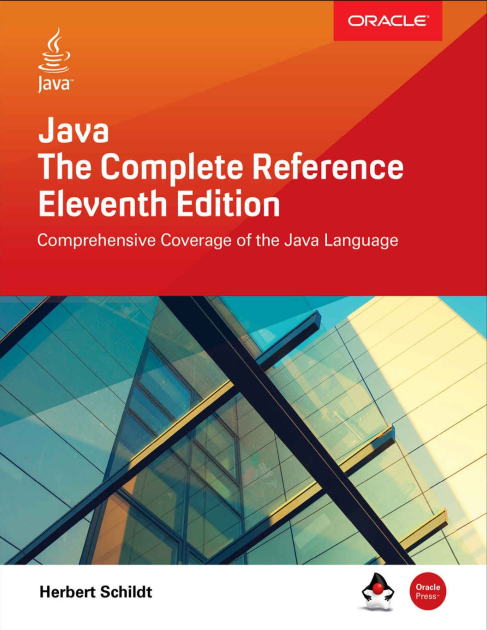

# Java-The-Complete-Reference

#### Progress...

Chapter | Title | Done
------- | ----- | ----
01 | Introduction & Installation | :heavy_check_mark:
02 | DataTypes, Variables, and Arrays | 
03 | Operators | 
04 | Control Statements | 
05 | Introducing Class | 
06 | Methods and Classes | 
07 | Inheritance | 
08 | Packages and Interface | 
09 | Exception Handling | 
10 | Multithreaded Programming | 
11 | Enumerations, Autoboxing, and Annotations | 
12 | I/O, Try-with-Resources, and Other Topics | 
13 | Generics | 
14 | Lambda | 
15 | Modules | 
16 | String Handling | 
17 | Exploring java.lang | 
18 | Exploring java.util | 
19 | Input/Output | 
20 | Exploring NIO | 
21 | Networking | 
22 | Event Handling | 
23 | Introducing the AWT | 
24 | Using AWT Controls, Images | 
25 | The Concurrency Utilities | 
26 | The Stream API | 
27 | Regular Expressions | 
28 | GUI Programming with Swing | 
29 | Applying Java | 
